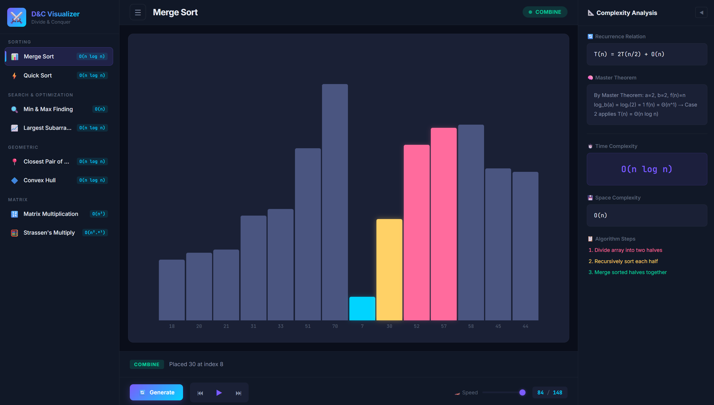
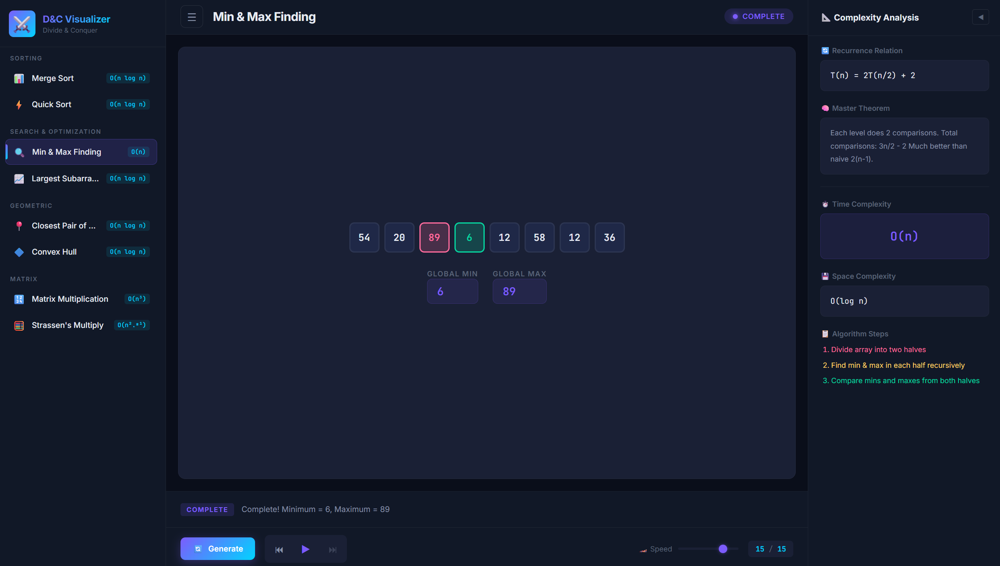
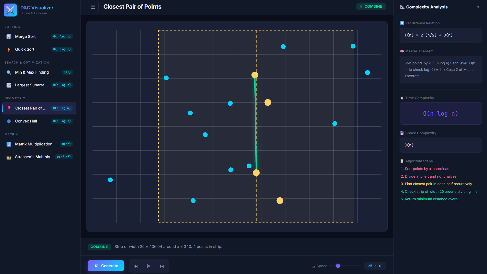
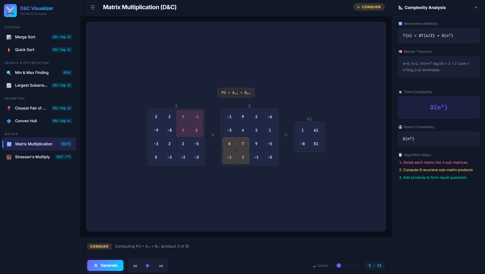

## Divide and Conquer Algorithm Visualizer / Playground

An interactive web application that visualizes Divide and Conquer algorithms with step-by-step animations and time complexity analysis. The project helps students understand how problems are divided into smaller subproblems, solved recursively, and combined to produce the final result.

### Features Included -

1) Step-by-step visualization of the algorithm
2) Clear explanation of Divide, Conquer, and Combine phases
3) Time complexity analysis using recurrence relations
4) Clean and user-friendly interface
5) Interactive learning for algorithm understanding

### Algorithms Implemented -

This project demonstrates one Divide and Conquer algorithm such as:
- Sorting
   1. Merge Sort
   2. Quick Sort
- Search & Optimization
   1. Strassen’s Matrix Multiplication
   2. Closest Pair of Points
- Geometric
   1. Closest Pair of Points
   2. Convex Hull
- Matrix
   1. Matrix Multiplication
   2. Strassen's Multiplication

<div align='center'>
  
  
  
  
</div>

### Working of Algorithms -

  1] How Divide and Conquer Works -
  
      Divide and Conquer is a strategy that solves a problem in three steps:
      1) Divide – Break the problem into smaller subproblems.
      2) Conquer – Solve each subproblem recursively.
      3) Combine – Merge the results of the subproblems to form the final solution.

  2] Time Complexity Analysis

      The time complexity of Divide and Conquer algorithms is often represented using a recurrence relation:
      
      T(n) = aT(n/b) + f(n)
      
      Where: a = no. of subproblems, n/b = size of each subproblem, f(n) = cost of dividing & combining

### Project Setup Guide -

1) Clone the repository ```git clone https://github.com/arpit-rath/Divide-Conquer-Algorithm-Visualizer.git```
2) Open the project folder
3) Run index.html in your browser
